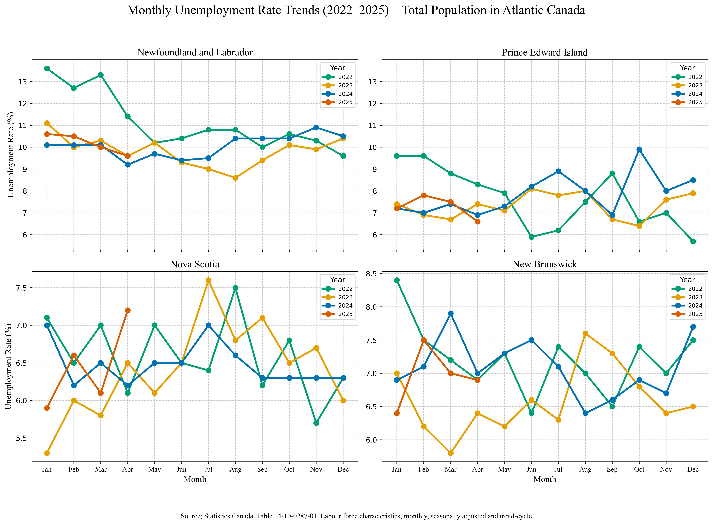
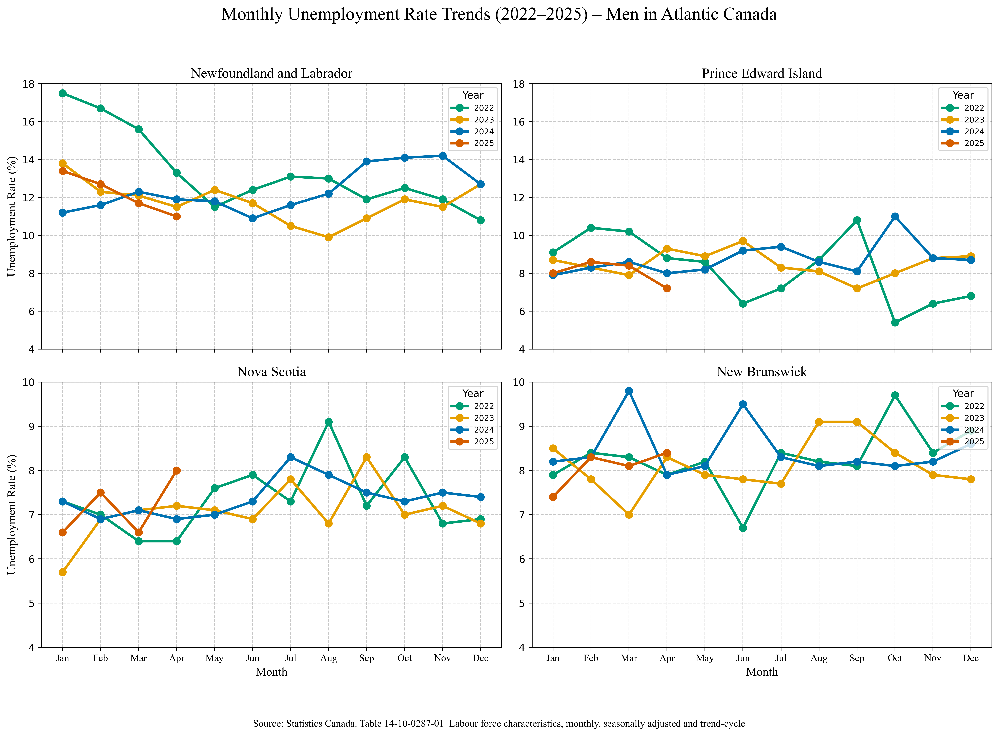

# Stories in Data

This project explores stories hidden within data through visualizations across fields like economics, health, environment, and society.

Each plot is linked with its code and dataset for easy exploration.

---
## 📂 Structure
- `plots/` – Visualizations
- `code/` – Jupyter Notebooks
- `data/` – Source datasets

---
## Notebooks & Visual Analyses

This section highlights weekly data stories created from public datasets, with links to the notebooks, visual outputs, and related posts.

### Unemployment Trends in Atlantic Canada (2022–2025)

**Notebook:** [`unemployment_atlantic_2022_25.ipynb`](Code/unemployment_atlantic_2022_25.ipynb)  
**LinkedIn Post:** [Read the analysis](https://www.linkedin.com/posts/saeed-saffari_unemployment-atlanticcanada-datavisualization-activity-7333095891005816832-tr6e?utm_source=share&utm_medium=member_desktop&rcm=ACoAABxmMQ8BrNvrJPWFJDGu5MP-misJR-duct8) 
**Focus:** Monthly unemployment rates (seasonally adjusted) for total population, women, and men across Newfoundland and Labrador, Prince Edward Island, Nova Scotia, and New Brunswick.

  
  
  

---

