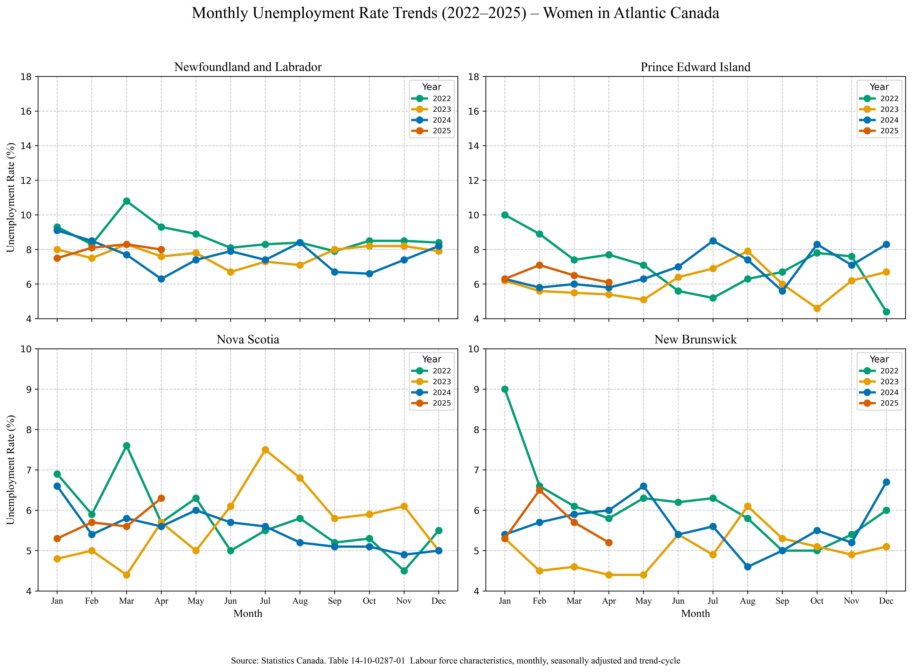

# Stories in Data

This project explores stories hidden within data through visualizations across fields like economics, health, environment, and society.

Each plot is linked with its code and dataset for easy exploration.

---
## 📂 Structure
- `plots/` – Visualizations
- `code/` – Jupyter Notebooks
- `data/` – Source datasets

---
## Notebooks & Visual Analyses

This section highlights weekly data stories created from public datasets, with links to the notebooks, visual outputs, and related posts.

### $\bullet$ Atlantic Canada Food Price Trends (2017–2025)

**Notebook:** [`Atlantic_Food_Price_Trends.ipynb`](Code/Atlantic_Food_Price_Trends.ipynb)  
**LinkedIn Post:** [Read the analysis](https://www.linkedin.com/posts/saeed-saffari_datavisualization-statisticscanada-atlanticcanada-activity-7338905451717173248-O_eJ?utm_source=share&utm_medium=member_desktop&rcm=ACoAABxmMQ8BrNvrJPWFJDGu5MP-misJR-duct8)  
**Focus:** Monthly and quarterly trends in retail food prices across the Atlantic provinces, including essential items, proteins, and fresh produce. The analysis highlights cumulative inflation patterns, seasonal variations, and provincial price differences from 2017 to 2025.

  
  

  
  

---

### $\bullet$ Canada’s Investment Income Overview (2010–Q1 2025)

**Notebook:** [`Balance_of_international_payments_Q1_2025.ipynb`](Code/Balance_of_international_payments_Q1_2025.ipynb)  
**LinkedIn Post:** [Read the analysis](https://www.linkedin.com/posts/saeed-saffari_canadaeconomy-investmentincome-datavisualization-activity-7335636422273458177-RVHx?utm_source=share&utm_medium=member_desktop&rcm=ACoAABxmMQ8BrNvrJPWFJDGu5MP-misJR-duct8)  
**Focus:** Quarterly trends in Canada’s investment income receipts, sources of income (direct, portfolio, interest), and the evolution of net investment income (receipts vs. payments) from 2010 to Q1 2025.

  
  

  
  

---

### $\bullet$ Unemployment Trends in Atlantic Canada (2022–2025)

**Notebook:** [`unemployment_atlantic_2022_25.ipynb`](Code/unemployment_atlantic_2022_25.ipynb)  
**LinkedIn Post:** [Read the analysis](https://www.linkedin.com/posts/saeed-saffari_unemployment-atlanticcanada-datavisualization-activity-7333095891005816832-tr6e?utm_source=share&utm_medium=member_desktop&rcm=ACoAABxmMQ8BrNvrJPWFJDGu5MP-misJR-duct8)  
**Focus:** Monthly unemployment rates (seasonally adjusted) for total population, women, and men across Newfoundland and Labrador, Prince Edward Island, Nova Scotia, and New Brunswick.

  
  
  

---

### $\bullet$ Building Permits Overview in Atlantic Canada (2021–2025)

**Notebook:** [`building permit.ipynb`](Code/builiding%20permit.ipynb)  
**LinkedIn Post:** [Read the analysis](https://www.linkedin.com/posts/saeed-saffari_atlanticcanada-buildingpermits-datavisualization-activity-7328969098942365696-3UVM?utm_source=share&utm_medium=member_desktop&rcm=ACoAABxmMQ8BrNvrJPWFJDGu5MP-misJR-duct8)  
**Focus:** Trends in total and per capita building permit values across Atlantic provinces (2021–2025), including growth patterns and province-level differences.

  
  
  

---

### $\bullet$ Food Expenditures in Canada (2021)

**Notebook:** [`Food_expenditures.ipynb`](Code/Food_expenditures.ipynb)  
**LinkedIn Post:** [Read the analysis](https://www.linkedin.com/posts/saeed-saffari_datavisualization-economics-householdspending-activity-7324982510910586880-A2-U?utm_source=share&utm_medium=member_desktop&rcm=ACoAABxmMQ8BrNvrJPWFJDGu5MP-misJR-duct8)  
**Focus:** Breakdown of food expenditure categories for Canadian households, including province-level comparisons.

  
  

---

